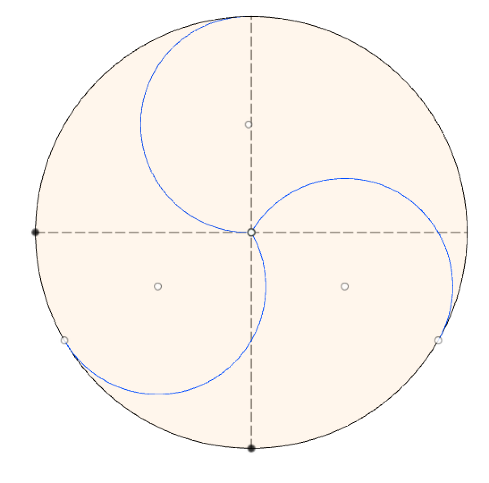

# Fusion360API
#### This repo will contain sketches that are made using the Fusion 360 API

### Circular Pattern exercise:

#####       Fusion360 supports circular pattern feature with 3d models but not for sketches.
#####
#####       A work around would be to create a collecion of objects in which you would store what you desire to rotate
#####       You will then proceed to transform the 'normal' sketch throughout the plane you want to rotate it around.
#####       You will need to make a 3d Matrix from which you will need to set your sketch rotation.
#####       You can do this with a simple for loop and a stepping variable where in you'll be copying 
#####       your entities collection accross the rotated matrix.
#####
#####       Downside to this is that the copies will not inherit or create new constraints and therefore you should
#####       think of another work around if you are solely working with the API instead of the GUI.

